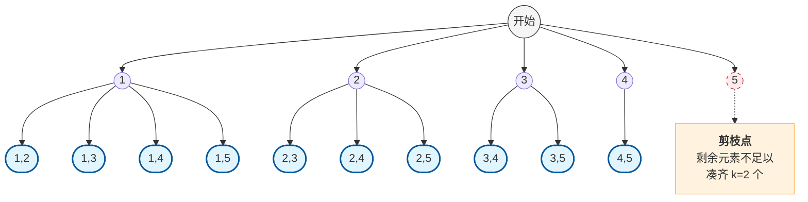

## 一、 实验目的

1. 深入理解回溯算法（Backtracking）的核心思想与应用场景。
2. 掌握通过“解空间树”分析算法执行过程的方法。
3. 学习如何通过剪枝（Pruning）优化搜索效率。

## 二、 问题描述

给定正整数 **$n=5$** 和 **$k=2$**，从集合 **$S=\{1, 2, 3, 4, 5\}$** 中找出所有不重复的 **$k$** 元素组合。

* **输入：** **$n=5, k=2$**
* **约束条件：** 组合不考虑顺序（即 **$\{1, 2\}$** 与 **$\{2, 1\}$** 视为同一组合），元素不可重复使用。

## 三、 算法设计与伪代码

回溯法采用深度优先遍历（DFS）的方式搜索解空间。为了处理“不重复组合”，我们引入变量 `startIndex`，确保每一层搜索都从前一个元素的下一个位置开始，从而避免产生排列重复。

### 3.1 算法步骤

1. **路径记录：** 使用 `path` 存储当前已选取的元素。
2. **终止条件：** 当 `path` 的长度等于 **$k$** 时，记录当前解。
3. **单层逻辑：** 从 `startIndex` 开始遍历到 **$n$**，递归调用进入下一层，回溯时弹出路径末尾元素。

### 3.2 代码

```cpp
#include <iostream>
#include <vector>

using namespace std;

class Solution {
private:
    vector<vector<int>> result; // 存放符合条件的所有组合
    vector<int> path;           // 存放当前搜索到的路径

    /**
     * 回溯算法核心函数
     * @param n 集合元素最大值
     * @param k 组合的目标大小
     * @param startIndex 本层搜索的起始位置
     */
    void backtracking(int n, int k, int startIndex) {
        // 终止条件：当路径长度达到 k 时，记录结果
        if (path.size() == k) {
            result.push_back(path);
            return;
        }

        // 剪枝优化：
        // 如果剩余元素不足以凑齐 k 个元素，则无需继续搜索
        // 搜索范围上限为：n - (k - path.size()) + 1
        for (int i = startIndex; i <= n - (k - path.size()) + 1; i++) {
            path.push_back(i);         // 处理节点
            backtracking(n, k, i + 1); // 递归：控制树的纵向深度
            path.pop_back();           // 回溯：撤销选择，准备横向遍历下一个元素
        }
    }

public:
    vector<vector<int>> combine(int n, int k) {
        result.clear();
        path.clear();
        backtracking(n, k, 1);
        return result;
    }
};

int main() {
    int n = 5, k = 2;
    Solution sol;
    vector<vector<int>> finalResult = sol.combine(n, k);

    // 输出结果
    cout << "从 1-" << n << " 中选出 " << k << " 个数的组合共有 " << finalResult.size() << " 组：" << endl;
    for (const auto& combination : finalResult) {
        cout << "{ ";
        for (int i = 0; i < combination.size(); i++) {
            cout << combination[i] << (i == combination.size() - 1 ? "" : ", ");
        }
        cout << " }" << endl;
    }

    return 0;
}
```

## 四、剪枝策略优化

在原始回溯中，我们会遍历到所有的节点。但在某些情况下，即便遍历完剩余所有元素，也无法凑齐 **$k$** 个元素，此时可以停止搜索。

### 4.1 剪枝原理

* 已经选取的元素个数：`path.size()`
* 还需要选取的元素个数：`k - path.size()`
* 从当前位置 **$i$** 开始，集合中剩余可用的元素个数（含 **$i$**）：`n - i + 1`
* **剪枝条件：** 如果 `n - i + 1 < k - path.size()`，则无需继续循环。

### 4.2 优化后的循环范围

遍历的 $i$ 应该满足：

$$
i \le n - (k - path.size()) + 1
$$

**在本题 (**$n=5, k=2$**) 中的具体体现：**

* 当选取第一个元素时（`path.size() = 0`），**$i$** 最大只需遍历到 **$5 - (2 - 0) + 1 = 4$**。
* 当 **$i=5$** 时，后面已经没有元素可以凑成 2 元组，故无需搜索 **$i=5$** 的分支。

## 五、 解空间树

解空间树是一个 **$n$** 叉树。根节点为空，第一层代表选择第一个元素，第二层代表选择第二个元素。




## 六、 实验结果

本题共求得 **10** 组不重复组合：

1. **$\{1, 2\}$**
2. **$\{1, 3\}$**
3. **$\{1, 4\}$**
4. **$\{1, 5\}$**
5. **$\{2, 3\}$**
6. **$\{2, 4\}$**
7. **$\{2, 5\}$**
8. **$\{3, 4\}$**
9. **$\{3, 5\}$**
10. **$\{4, 5\}$**

## 七、 结论

通过回溯法，我们能够系统地搜索所有可能的解组合。通过设置合理的 `startIndex` 解决了组合重复问题，而剪枝策略则在处理大规模数据时能显著提升算法的执行效率，降低搜索的时间复杂度。

